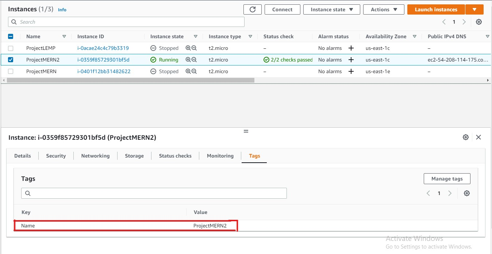

## **Project Three** ##
### SIMPLE TO-DO APPLICATION ON MERN WEB STACK
In this project, you are tasked to implement a web solution based on MERN stack in AWS Cloud

1. Lunch an EC2 t2-micro instance

[EC2 Instance] 

