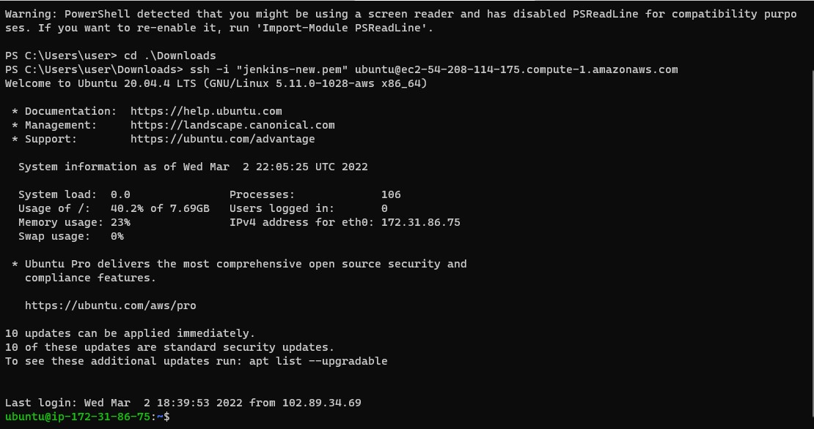
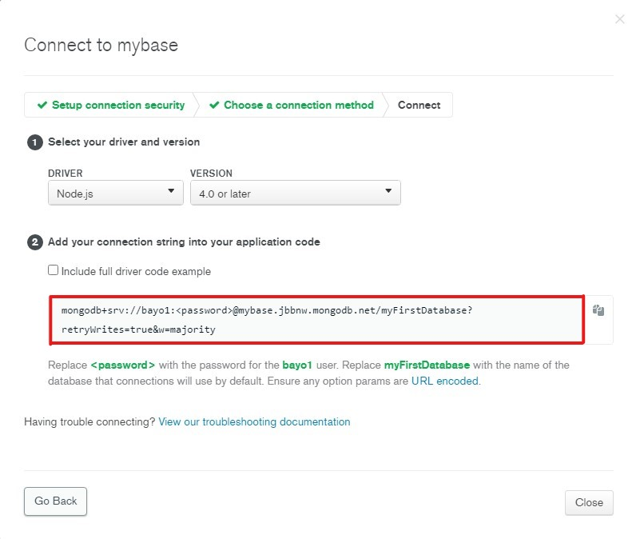
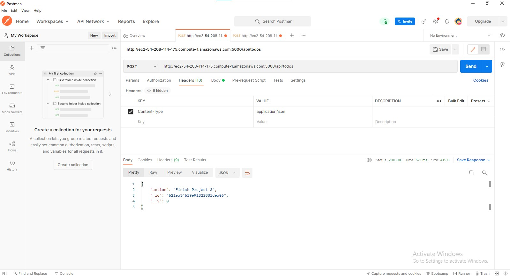
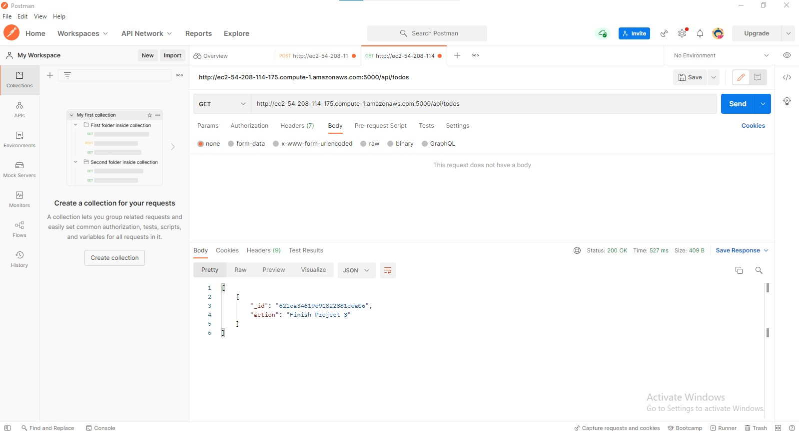
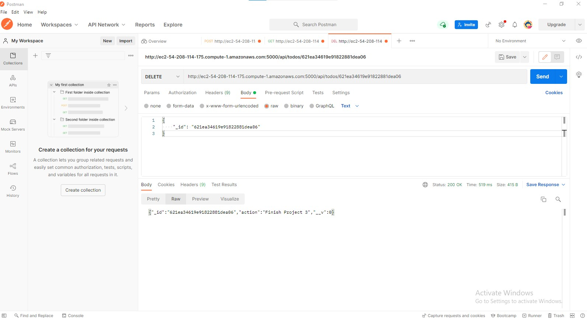

## **Project Three** ##
### SIMPLE TO-DO APPLICATION ON MERN WEB STACK
In this project, you are tasked to implement a web solution based on MERN stack in AWS Cloud

1. Lunch an EC2 t2-micro instance

[EC2 Instance] 


2. Login into EC2 instance



3. Update and Upgrade your Ubuntu machine

``` 
sudo apt update -y && sudo apt upgrade -y
```
4. Add Node.js location from Ubuntu Repo

```
curl -sL https://deb.nodesource.com/setup_12.x | sudo -E bash -
```
sudo apt-get install -y nodejs
sudo apt-get install -y nodejs

5. Install Node.js

```
sudo apt-get install -y nodejs
```

6. Create a directory todo and move into it

```
mkdir todo && cd todo

7. Run command to initialise the project and place package.json in the directory. Provide appropriate responses as the initialisation progresses
```
npm init

8. Install ExpressJS

```
npm install express
```
create index.js file

```
touch index.js
```

9. Install dotenv
```
npm install dotenv
```
populate the index.js file

Run node.js with
```
node index.js
```
Success is indicated by **Server running on port 5000** message

10. **Routes**

Our app should be able to
* Create a task (POST)
* Display list of tasks (GET)
* Remove completed tasks (DELETE)

in the todo directory, create routes directory and move into it

mkdir routes && cd routes

create api.js file and populate it

```
touch api.js
```

11. To make our app interactive, we need *Models*


Go into todo directory, Install moongose, a no-sql database and create todo.js file
```
mkdir models && cd models && touch todo.js

```

12. MONGODB Database
mLab provide Mongodb as a DBaaS, click [here](https://www.mongodb.com/atlas-signup-from-mlab) to sign up
Create an account and then setup your project with it database
Copy the connection string as seen below

moongose connection string



Copy and paste the content of the connection string into .env file you will create in todo directory
Update the content of index.js file to reflect that **.env** file is being used for database connection purposes

13. Run the engine again with 
```
node index.js
```
14. POSTMAN 
Is a browser on steroids. It will be used to test the API
We will perform CRUD (Creat, Read, Update and Delete)

See the screenshots below to see how it is done with Postman

POST


GET


DELETE


15. FRONTEND

From the todo directory, create a user interface for a web client (browser) with
```
npx create-react-app client
```
this will create a client directory and add all react files

install concurrently to allow miltiple simultenous commands from same terminal and nodemon to monitor the server
```
npm install concurrently --save-dev

npm install nodemon --save-dev
```

Install axios
```
npm install axios
```
Populate the files with appropriate contents


Open port 3000 for incoming TCP traffic
Set brower to your Public IP and port 3000
ip-address:3000

App Page

